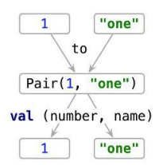

### 가변길이 파라미터<sup>varargs</sup>

* `vararg` 키워드를 사용해서 파라미터를 선언하면 여러 개의 값을 한번에 받을 수 있는 **가변길이 파라미터**를 선언할 수 있다.

```kotlin
public fun <T> listOf<T>(vararg elements: T): List<T> { ... }

val list = listOf(2, 3, 5, 7, 11)
```

* `vararg` 키워드를 통해 받은 파라미터는 `Array<T>` 타입을 가진 변수로 취급되게 된다.
* **스프레드<sup>Spread</sup> 연산자**를 사용하게되면 배열의 내용을 가변길이 파라미터로 넘겨줄 수 있게 된다.

```kotlin
fun main(args: Array<String>) { // 실행시 넘겨준 값 ["1", "2", "3"]
  val list = listOf("args: ", *args)
  println(list)
  // ["args: ", "1", "2", "3"]
}
```

### 중위 호출<sup>infix calls</sup>

```kotlin
val map = mapOf(1 to "one", 7 to "seven", 53 to "fifty-three")
```

* `to`는 언뜻보기에 키워드 같지만 키워드가 아닌 **중위 호출<sup>infix calls</sup>**로 `to()` 라는 일반 메소드를 호출한 것이다.

```kotlin
infix fun Any.to(other: Any) =
	Pair(this, other) // Pair는 코틀린 표준 라이브러리 클래스
```

### 구조 분해 선언<sup>Destructuring declaration</sup>

```kotlin
val (number, name) = 1 to "one"
```

* `Pair` 객체의 구조를 분해해서 각각의 값을 `number`, `name`이라는 변수에 초기화시키는 이런식의 코드를 **구조 분해 선언<sup>Destructuring declaration</sup>**이라고 부른다.



* 앞서 `for` 루프 안에서 `withIndex()`를 했을 때, `index`와 `element`를 따로 받을 수 있었던 것도 이 구조 분해 선언을 통해 가능한 일이었다.

#### Tip) 코틀린에서 제공하는 자바 컬렉션 API의 확장

* 코틀린에서는 자바와 같은 컬렉션을 사용하지만 더욱 확장된 API 또한 제공하고 있다.
* 예를 들면 다음과 같은 `last()`, `max()` 등이 그 예시다

```kotlin
val strings: List<String> = listOf("first", "second", "fourteenth")
strings.last() // fourteenth

val numbers: Collection<Int> = setOf(1, 14, 2)
numbers.max() // 14
```


### Tip) 로컬 함수<sup>Local functions</sup>과 확장 함수<sup>Extension functions</sup>으로 코드 리팩토링 사례

```kotlin
class User(val id: Int, val name: String, val address: String)

fun saveUser(user: User) {
  if (user.name.isEmpty()) {
    throw IllegalArgumentException("Can't save user ${user.id}: empty Name")
  }
  
  if (user.address.isEmpty()) {
    throw IllegalArgumentException("Can't save user ${user.id}: empty Address")
  }
  
  // user를 DB에 저장
}
```

* 위와 같은 코드에서 느껴지는 코드 스멜은 다음과 같다.
  * **검증 코드의 중복** : `name`과 `address`의 값이 비어있는지 검증하는 부분이 비슷하므로 이는 중복되고 있다.

### 로컬 함수<sup>Local functions</sup>로 코드 중복 제거

```kotlin
class User(val id: Int, val name: String, val address: String)

fun saveUser(user: User) {
  fun validate(user: User,
               value: String,
               fieldName: String) {
    if (value.isEmpty()) {
      throw IllegalArgumentException("Can't save user ${user.id}: empty $fieldName")
    }
  }

  validate(user, user.name, "Name")
  validate(user, user.address, "Address")
  
  // user를 DB에 저장
}
```

* `validate()`라는 로컬 함수<sup>Local function</sup>를 만들어서 해결하는 코드를 작성했다.
* 하지만, 로컬 함수는 바깥 함수의 파라미터에 접근할 수 있으므로 `user: User` 파라미터는 받을 필요가 없다.

```kotlin
class User(val id: Int, val name: String, val address: String)

fun saveUser(user: User) {
  fun validate(value: String,
               fieldName: String) {
    if (value.isEmpty()) {
      throw IllegalArgumentException("Can't save user ${user.id}: empty $fieldName")
    }
  }

  validate(user.name, "Name")
  validate(user.address, "Address")
  
  // user를 DB에 저장
}
```

### 확장 함수<sup>Extension functions</sup>로 리팩토링

* 코드 중복은 줄였으나, `User` 객체의 유효성을 검증하는 함수를 `User` 클래스의 확장 함수로 만들 수 있다.

```kotlin
class User(val id: Int, val name: String, val address: String)

fun User.validateBeforeSave() {
  fun validate(value: String,
               fieldName: String) {
    if (value.isEmpty()) {
      throw IllegalArgumentException("Can't save user ${user.id}: empty $fieldName")
    }
  }

  validate(user.name, "Name")
  validate(user.address, "Address")
}

fun saveUser(user: User) {
  user.validateBeforeSave()
  
  // user를 DB에 저장
}
```

