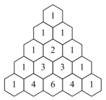
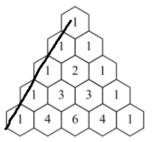
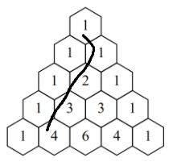
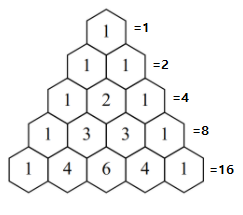
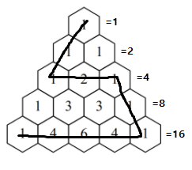

# Pascal Walk Solution
> Google CodeJam 2020 - Round 1A 2020
> 
> [Problem](https://codingcompetitions.withgoogle.com/codejam/round/000000000019fd74/00000000002b1353)

올해 중순쯤 대학교 동기들과 Google CodeJam 스터디를 진행하면서 봤던 문제인데, 창의적이고 잘만든 문제인 것 같아서 기록하고자 한다.

## Problem

[파스칼 삼각형](https://en.wikipedia.org/wiki/Pascal%27s_triangle)이 주어진다. 맨 위 1번 칸에서 출발해서 인접한 칸들을 밟아 모든 숫자들을 더했을 때 N이 되는 경로를 찾으면 되는 문제다.



제약사항은 다음과 같다:
- 파스칼 삼각형은 길이가 무한하다. 즉, 아래로 무한히 존재한다.
- **경로(Pascal Walk)는 최대 500개 칸을 밟을 수 있다.**

**Input**

- Case 1) 1 <= N <= 501

- Case 2) 1 <= N <= 1000

- Case 3) 1 <= N <= 10<sup>9</sup>

**Output**

- 경로 S개만큼의 칸 좌표 출력
  - 좌표는 (r, k) 형태로 표현할 수 있으며, r은 row / k는 맨 왼쪽에서 몇번째 칸인지를 의미한다.
  - 즉, 위 사진에서 정중앙에 있는 '2'가 있는 칸의 좌표는 3번째 줄의 왼쪽에서 2번째 칸이기 때문에 (3, 2)로 표현할 수 있다.

## Solution

### 1. N이 최대 500 일 때 풀이

먼저 위 파스칼 삼각형을 보면 맨 왼쪽 칸과 맨 오른쪽 칸은 아래로 내려가도 항상 1인 것을 알 수 있다.



위 사진처럼 모든 칸을 1만 밟도록 경로를 만들면, 최대 N이 500일 때까지 경로를 만들 수 있다. N이 500인 이유는 경로는 최대 500칸이라는 제약조건이 있기 때문이다.

### 2. N이 최대 1000 일 때 풀이

솔루션 1번은 맨 왼쪽을 타고 내려왔다. 하지만, 아래 그림처럼 내려오게되면 어떻게 될까?



* 1 + 1 + 2 + 3 + 4 + ...

1부터 시작하는 등차수열임을 확인할 수 있다. 1부터 N까지의 합을 구하는 공식은 N * (N + 1) / 2 인데 1부터 45까지 더하면 1,035이므로 N이 최대 1000인 경우에는 충분히 구할 수 있다.

만약, 등차수열로 딱 떨어지지 않는다면 부족한 만큼 경로상 왼쪽에 있는 1 타일을 경로에 추가해서 채울 수 있다.

> 1000을 예로 들어보면 44까지 밟고 왼쪽의 1을 44개만 더 경로에 추가하면 된다.
> 1 + (1 + 2 + 3 + 4 + .. + 44) + (1 * 9)
> 총 54개 타일

하지만, 등차수열을 통해 10억의 숫자를 채우기에는 턱없이 부족하다.

### 3. N이 최대 10억일 때 풀이

위 풀이들과 완전히 다른 생각의 전환이 필요하다.

파스칼 삼각형의 특징을 알아보자. 한 칸은 다음 줄에 있는 두 칸에 영향을 준다. 즉, 첫번째 줄의 숫자가 N이라고 치면, 다음 줄의 모든 타일의 숫자 합이 2N 보다는 크거나 같아야한다.

각 줄의 모든 칸의 숫자를 다 더한 값을 표현해보면 항상 2의 제곱으로 표현가능하다.



10억까지의 숫자를 2진수로 표현하면 최대 30자리면 표현가능하다. 이 사실들을 종합해보면 각 비트를 row로 보고 1인 비트의 자리에 해당하는 줄의 칸들을 다 합치면 N을 만들 수 있다는 것이다.

30자리라고 쳤을 때, 모든 비트가 1이면 30줄까지 있는 모든 칸을 다 밟아야한다. 계산해보면 30 * 31 / 2 = 465. 즉, 465 칸을 거쳐야 한다. 최대 500개 제한에 걸리지 않으므로 가능하다.

그런데 문제가 있다. 바로, 0인 비트의 자리를 건너 뛸 수 없는 것이다. 최소한 1이 있는 칸을 거쳐야만 특정 라인에 도달할 수 있다. 그럼 어떻게 해야할까? **바로 30을 N에서 뺀 상태에서 경로를 만드는 것이다.**

위 알고리즘대로 경로를 만들려면 최소 1을 30번 이상 밟아야한다. 따라서, 필수적으로 밟아야할 30을 미리 빼주고 남은 것을 비트로 계산해서 채워주면 된다. 그렇게 되면 다음처럼 경로를 만들 수 있다.



위 그림처럼 2진수 비트가 10101 인 경우 저렇게 0인 비트는 1 타일만 지나가고 1인 비트에 해당하는 자리는 해당 라인의 모든 타일을 밟도록 작성하면 된다. 만약 다 밟고나서 숫자가 모자른다면 그 아래로 1이 무한히 있기 때문에 필요한 만큼 1을 더 밟도록 경로를 만들면 해결 가능하다.

## Code

```python
import sys
L = sys.stdin.read().rstrip().split('\n')
T = int(L[0])
for t in range(T):
    path = []
    N = int(L[t + 1]) - 30 # 30을 뺌
    if N <= 0:
        for i in range(1, N + 31):
            path.append((i, 1))
    else:
        isLeft = True
        s = 0
        for row in range(1, 31):
            col = 1 if isLeft else row
            if (N & (1 << (row - 1))) == 0:
                s += 1
                path.append((row, col))
            else:
                s += (1 << (row - 1))
                stepPath = range(1, row + 1) if isLeft else range(row, 0, -1)
                for step in stepPath:
                    path.append((row, step))
                isLeft = not isLeft
        row = 31
        while N + 30 > s:
            col = 1 if isLeft else row
            path.append((row, col))
            s += 1
            row += 1
    
    print('Case #{:d}:'.format(t + 1))
    for x, y in path:
        print(x, y)
```